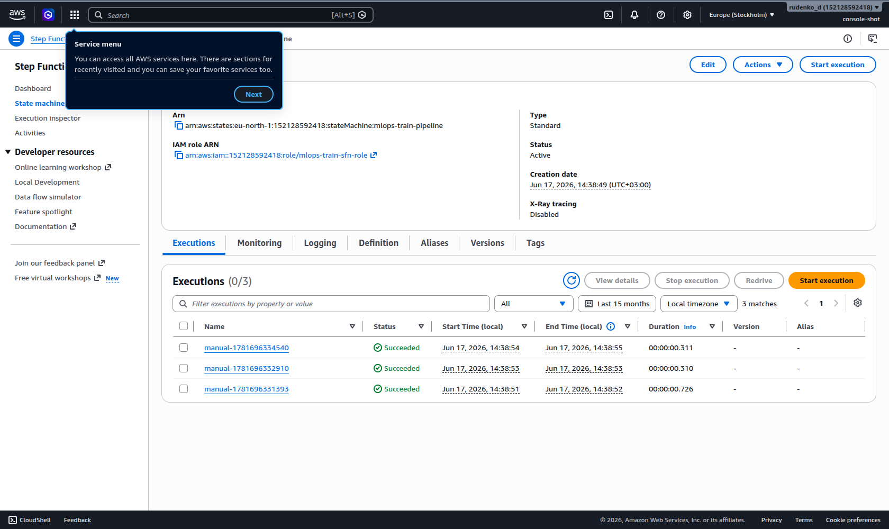
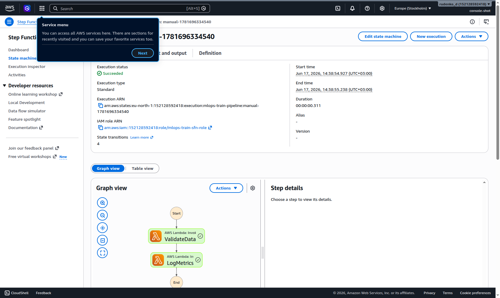
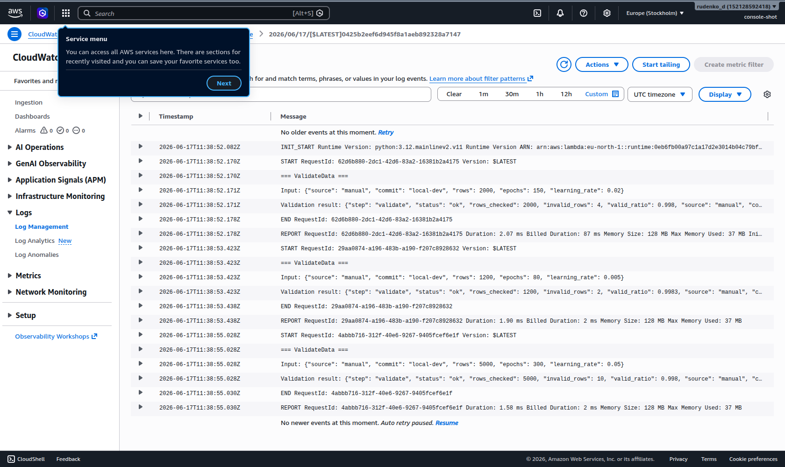

# Lesson 10 — Автоматизоване тренування моделей (Step Functions + Lambda + GitLab CI)

ДЗ10: пайплайн тренування ML-моделі як **AWS Step Function** з двох кроків
(`ValidateData → LogMetrics`), реалізованих **Lambda**-функціями, описаний у
**Terraform** і запускний на кожен push через **GitLab CI**.

## Архітектура

```
git push → GitLab CI (train-model job)
                │  aws stepfunctions start-execution --input '{"source":"gitlab-ci",...}'
                ▼
        Step Function: mlops-train-pipeline
                ├─ ValidateData  → Lambda mlops-train-validate
                └─ LogMetrics    → Lambda mlops-train-log-metrics
```

## Скриншоти (AWS Console)

Реальні сторінки AWS Console, акаунт `152128592418`, регіон `eu-north-1`.

### 1. Step Functions — список виконань

Машина станів `mlops-train-pipeline`, вкладка **Executions**: три запуски зі статусом
**Succeeded** (тривалість, час старту/завершення).



### 2. Граф виконання `ValidateData → LogMetrics`

**Graph view** одного виконання: `Start → ValidateData → LogMetrics → End`, усі кроки
зелені (Succeeded). Кожен Task викликає відповідну Lambda.



### 3. CloudWatch — лог Lambda `validate`

Лог-група `/aws/lambda/mlops-train-validate`, останній log stream: `print()`-вивід
функції (`=== ValidateData ===`, вхідний JSON, `Validation result`) і `REPORT` із
Duration/Memory.



## CLI-перевірка (реальні виводи)

```text
$ terraform apply -auto-approve
Apply complete! Resources: 7 added, 0 changed, 0 destroyed.
Outputs:
state_machine_arn   = "arn:aws:states:eu-north-1:152128592418:stateMachine:mlops-train-pipeline"
validate_lambda_arn = "arn:aws:lambda:eu-north-1:152128592418:function:mlops-train-validate"

$ aws stepfunctions list-executions --state-machine-arn "$SM_ARN" --status-filter SUCCEEDED \
      --query 'executions[].{name:name,status:status}' --output table
|  manual-1781696334540 |  SUCCEEDED  |
|  manual-1781696332910 |  SUCCEEDED  |
|  manual-1781696331393 |  SUCCEEDED  |

$ aws stepfunctions describe-execution --execution-arn "$L" --query output
{ "status": "succeeded",
  "validate": { "status": "ok", "rows_checked": 5000, "valid_ratio": 0.998 },
  "metrics":  { "accuracy": 0.99, "loss": 0.15, "f1": 0.98, "epochs": 300 } }
```

> **GitLab CI:** репозиторій тут на GitHub, тож сам пайплайн не виконується. Файл
> `.gitlab-ci.yml` (job `train-model` → `aws stepfunctions start-execution`) повністю
> готовий — для реального запуску продублюйте репо в GitLab і додайте CI-змінні
> (`AWS_*`, `STATE_MACHINE_ARN`).

## Структура

```
lesson-10/
├── terraform/
│   ├── main.tf            # IAM ролі, 2 Lambda, Step Function, outputs
│   ├── variables.tf
│   └── lambda/
│       ├── validate.py        # крок 1 — валідація
│       ├── log_metrics.py     # крок 2 — логування метрик
│       ├── validate.zip       # архів (генерує terraform / zip)
│       └── log_metrics.zip
├── .gitlab-ci.yml        # job train-model → start-execution
└── README.md
```

## 1. Збірка Lambda-архівів

Terraform пакує `.py` у `.zip` автоматично (`archive_file`). Вручну — так:

```bash
cd terraform/lambda
zip validate.zip validate.py
zip log_metrics.zip log_metrics.py
```

## 2. Розгортання інфраструктури (Terraform)

```bash
cd terraform
terraform init
terraform apply
```

Створює: IAM ролі (Lambda + Step Function), 2 Lambda-функції, Step Function.
ARN машини станів — в `terraform output state_machine_arn`.

## 3. Ручна перевірка Step Function

**Через AWS Console:** Step Functions → `mlops-train-pipeline` → **Start execution** →
вставити JSON (нижче) → Start. Має пройти `ValidateData → LogMetrics`, статус *Succeeded*.

**Через CLI:**

```bash
aws stepfunctions start-execution \
  --state-machine-arn "$(terraform -chdir=terraform output -raw state_machine_arn)" \
  --name "manual-$(date +%s)" \
  --input '{"source":"manual","commit":"local"}'
```

## 4. GitLab CI

`.gitlab-ci.yml` має job **train-model** (stage `train`, образ `amazon/aws-cli:2.15.0`),
який на кожен **push** викликає `aws stepfunctions start-execution`.

Потрібні CI/CD variables (Settings → CI/CD → Variables):

| Variable | Значення |
|---|---|
| `AWS_ACCESS_KEY_ID` | ключ IAM-користувача (право `states:StartExecution`) |
| `AWS_SECRET_ACCESS_KEY` | секрет |
| `AWS_DEFAULT_REGION` | `eu-north-1` |
| `STATE_MACHINE_ARN` | `terraform output state_machine_arn` |

### Приклад JSON, який передається через CI

```json
{ "source": "gitlab-ci", "commit": "$CI_COMMIT_SHORT_SHA" }
```

## ⚠️ Вартість і прибирання

Lambda + Step Functions — у межах Free Tier (мільйон викликів Lambda і 4000 переходів
Step Functions на місяць безкоштовно). Після перевірки:

```bash
cd terraform && terraform destroy
```

> S3-бакет зі стейтом лишити (backend).
