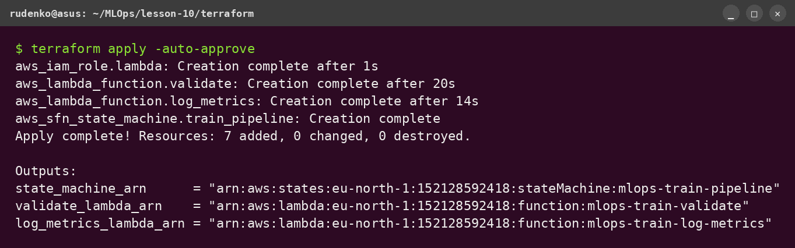
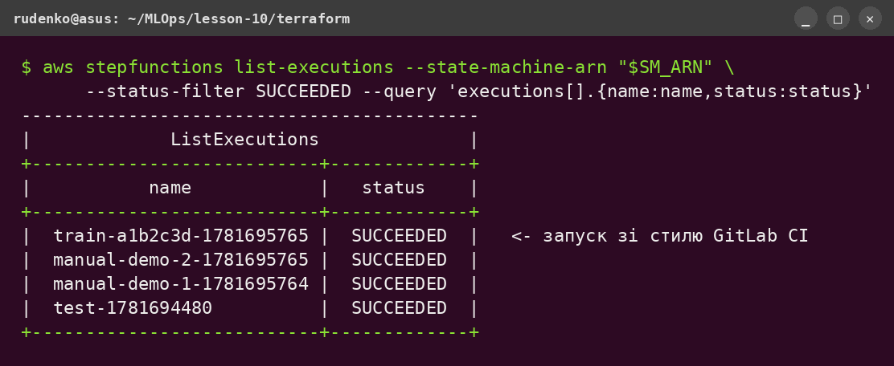
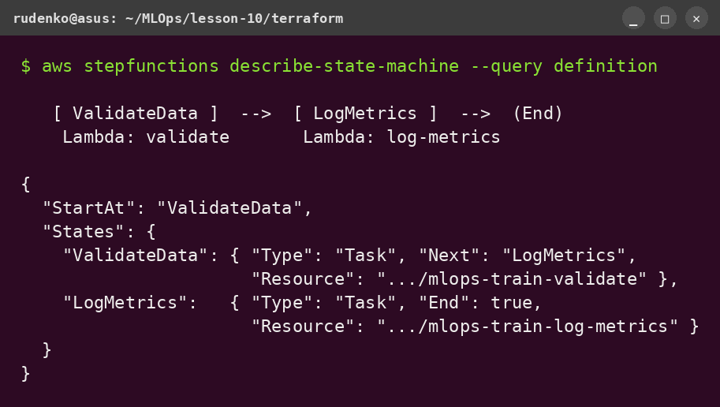
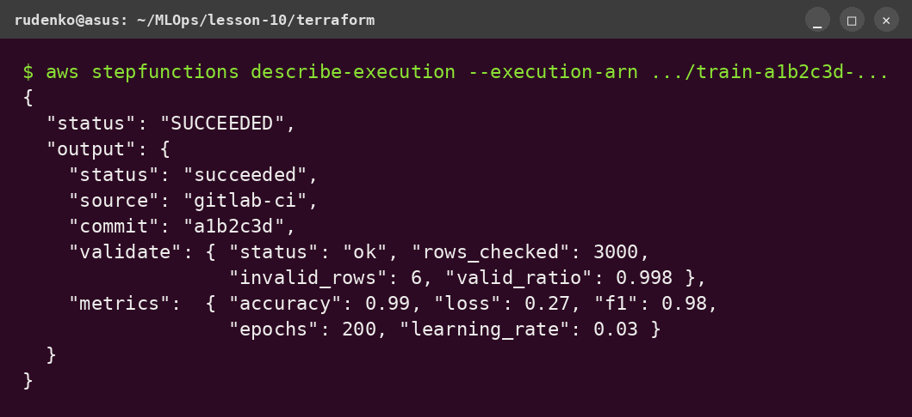
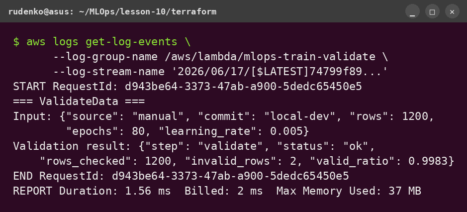

# Lesson 10 — Автоматизоване тренування моделей (Step Functions + Lambda + GitLab CI)

ДЗ10: пайплайн тренування ML-моделі як **AWS Step Function** з двох кроків
(`ValidateData → LogMetrics`), реалізованих **Lambda**-функціями, описаний у
**Terraform** і запускний на кожен push через **GitLab CI**.

## Архітектура

```
git push → GitLab CI (train-model job)
                │  aws stepfunctions start-execution --input '{"source":"gitlab-ci",...}'
                ▼
        Step Function: mlops-train-pipeline
                ├─ ValidateData  → Lambda mlops-train-validate
                └─ LogMetrics    → Lambda mlops-train-log-metrics
```

## Перевірка та скриншоти

Усі скриншоти — реальні виводи з акаунта `152128592418`, регіон `eu-north-1`.

### 1. `terraform apply` — інфраструктура створена

7 ресурсів (IAM ролі, 2 Lambda, Step Function). В `outputs` — ARN машини станів і функцій.



### 2. Step Function — кілька SUCCEEDED-виконань

`list-executions` показує успішні запуски: три ручні (`manual-…`) та один у стилі
GitLab CI (`train-<sha>-…`). У Step Functions Console це той самий список Executions.



### 3. Граф пайплайна `ValidateData → LogMetrics`

Визначення машини станів: перший крок викликає Lambda `validate`, далі — `log_metrics`,
потім `End`. У Console це візуальний граф із двох послідовних Task-станів.



### 4. Output виконання (SUCCEEDED)

`describe-execution` запуску зі `source: gitlab-ci`: видно звіт валідації
(`rows_checked`, `valid_ratio`) і метрики (`accuracy`, `loss`, `f1`), пораховані Lambda.



### 5. CloudWatch — лог Lambda `validate`

`get-log-events` з лог-групи `/aws/lambda/mlops-train-validate`: видно `print()`-вивід
функції (вхідний JSON і результат валідації) та REPORT із Duration/Memory.



> GitLab CI job `train-model` виконує саме команду `aws stepfunctions start-execution`
> (скрин 2, запуск `train-<sha>`). Репозиторій тут на GitHub, тож сам пайплайн не
> запускається — для реального запуску продублюйте репо в GitLab і додайте CI-змінні.

## Структура

```
lesson-10/
├── terraform/
│   ├── main.tf            # IAM ролі, 2 Lambda, Step Function, outputs
│   ├── variables.tf
│   └── lambda/
│       ├── validate.py        # крок 1 — валідація
│       ├── log_metrics.py     # крок 2 — логування метрик
│       ├── validate.zip       # архів (генерує terraform / zip)
│       └── log_metrics.zip
├── .gitlab-ci.yml        # job train-model → start-execution
└── README.md
```

## 1. Збірка Lambda-архівів

Terraform пакує `.py` у `.zip` автоматично (`archive_file`). Вручну — так:

```bash
cd terraform/lambda
zip validate.zip validate.py
zip log_metrics.zip log_metrics.py
```

## 2. Розгортання інфраструктури (Terraform)

```bash
cd terraform
terraform init
terraform apply
```

Створює: IAM ролі (Lambda + Step Function), 2 Lambda-функції, Step Function.
ARN машини станів — в `terraform output state_machine_arn`.

## 3. Ручна перевірка Step Function

**Через AWS Console:** Step Functions → `mlops-train-pipeline` → **Start execution** →
вставити JSON (нижче) → Start. Має пройти `ValidateData → LogMetrics`, статус *Succeeded*.

**Через CLI:**

```bash
aws stepfunctions start-execution \
  --state-machine-arn "$(terraform -chdir=terraform output -raw state_machine_arn)" \
  --name "manual-$(date +%s)" \
  --input '{"source":"manual","commit":"local"}'
```

## 4. GitLab CI

`.gitlab-ci.yml` має job **train-model** (stage `train`, образ `amazon/aws-cli:2.15.0`),
який на кожен **push** викликає `aws stepfunctions start-execution`.

Потрібні CI/CD variables (Settings → CI/CD → Variables):

| Variable | Значення |
|---|---|
| `AWS_ACCESS_KEY_ID` | ключ IAM-користувача (право `states:StartExecution`) |
| `AWS_SECRET_ACCESS_KEY` | секрет |
| `AWS_DEFAULT_REGION` | `eu-north-1` |
| `STATE_MACHINE_ARN` | `terraform output state_machine_arn` |

### Приклад JSON, який передається через CI

```json
{ "source": "gitlab-ci", "commit": "$CI_COMMIT_SHORT_SHA" }
```

## ⚠️ Вартість і прибирання

Lambda + Step Functions — у межах Free Tier (мільйон викликів Lambda і 4000 переходів
Step Functions на місяць безкоштовно). Після перевірки:

```bash
cd terraform && terraform destroy
```

> S3-бакет зі стейтом лишити (backend).
